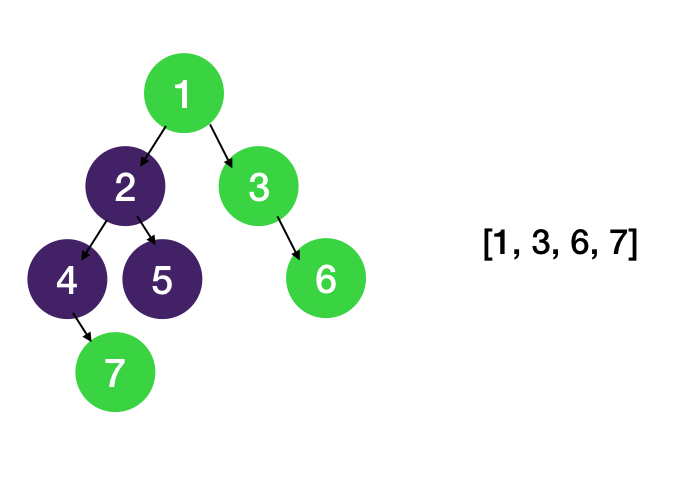
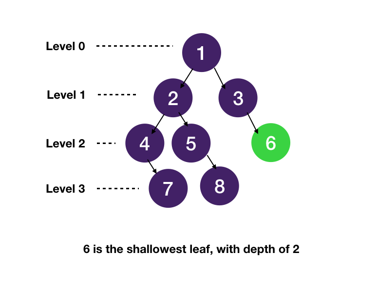

# BFS

BFS visits all nodes in a level before starting to visit the next level.
We can use a queue for BFS traversal.

- [BFS](#bfs)
  - [Level Order Traversal](#level-order-traversal)
  - [ZigZag Level Order Traversal](#zigzag-level-order-traversal)
  - [Binary Tree Right Side View](#binary-tree-right-side-view)
  - [Binary Tree Min Depth](#binary-tree-min-depth)

## Level Order Traversal


```java
import java.util.Queue;
import java.util.LinkedList;
import java.util.List;
import java.util.ArrayList;

public static List<List<Integer>> levelOrderTraversal(Node<Integer> root) {
    List<List<Integer>> lot = new ArrayList<>();
    if(root == null) return lot;
    Queue<Node<Integer>> queue = new LinkedList<>();
    queue.offer(root);
    while(!queue.isEmpty()){
        int n = queue.size();
        List<Integer> newLevel = new ArrayList<>();
        for(int i = 0; i < n; i++) {
            Node<Integer> node = queue.poll();
            newLevel.add(node.val);
            if(node.left != null) queue.offer(node.left);
            if(node.right != null) queue.offer(node.right);
        }
        lot.add(newLevel);
    }
    return lot;
}
```

## ZigZag Level Order Traversal


```java
import java.util.Queue;
import java.util.LinkedList;
import java.util.List;
import java.util.ArrayList;
import java.util.ArrayDeque;

public static List<List<Integer>> zigZagTraversal(Node<Integer> root) {
    List<List<Integer>> lot = new ArrayList<>();
    if(root == null) return lot;
    Queue<Node<Integer>> queue = new LinkedList<>();
    queue.offer(root);
    boolean ltr = true;
    while(!queue.isEmpty()){
        int n = queue.size();
        ArrayDeque<Integer> newLevel = new ArrayDeque<Integer>();
        for(int i = 0; i < n; i++) {
            Node<Integer> node = queue.poll();
            if(ltr) {
                newLevel.add(node.val);
            } else {
                newLevel.addFirst(node.val);
            }
            if(node.left != null) queue.offer(node.left);
            if(node.right != null) queue.offer(node.right);
        }
        ltr = !ltr;
        lot.add(new ArrayList(newLevel));
    }
    return lot;
}
```

## Binary Tree Right Side View



> The question is asking to get last element of level order traversal

```java
import java.util.List;
import java.util.ArrayList;
import java.util.Queue;
import java.util.LinkedList;

public static List<Integer> binaryTreeRightSideView(Node<Integer> root) {
    List<Integer> ans = new ArrayList<>();
    Queue<Node<Integer>> queue = new LinkedList<>();
    queue.offer(root);
    while(!queue.isEmpty()) {
        int n = queue.size();
        for(int i = 0; i < n; i++) {
            Node<Integer> node = queue.poll();
            if(i == n - 1) ans.add(node.val);

            if(node.left != null) queue.offer(node.left);
            if(node.right != null) queue.offer(node.right);
        }
    }
    return ans;
}
```

## Binary Tree Min Depth



```java
import java.util.Queue;
import java.util.LinkedList;

public static int binaryTreeMinDepth(Node<Integer> root) {
    int depth = 0;
    if(root == null) return depth;

    Queue<Node<Integer>> queue = new LinkedList<>();
    queue.offer(root);

    while(!queue.isEmpty()) {
        int n = queue.size();
        for(int i = 0; i < n; i++) {
            Node<Integer> node = queue.poll();

            if(node.left == null && node.right == null)
                return depth;

            if(node.left != null) queue.offer(node.left);
            if(node.right != null) queue.offer(node.right);
        }
        depth += 1;
    }
    return depth;
}
```
