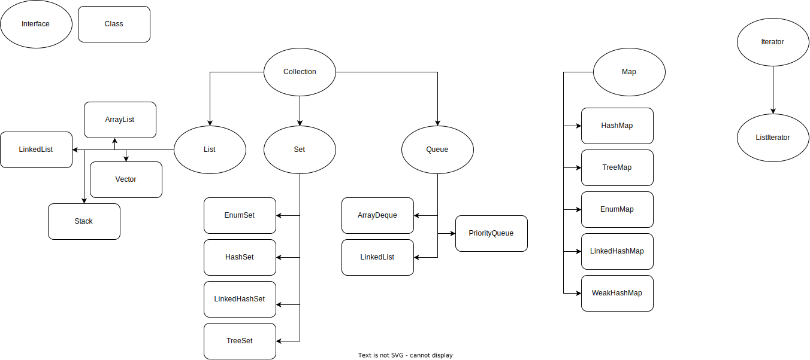

# JAVA Collection Framework



## Collection

### List

#### ArrayList

- Overcomes the fixed size limitation of an array
- Uses an array underline and grows as the array fills up.
- `add` method to add the element
- `set` method to update an index value
- `get` method to get the index value

```java
import java.util.ArrayList;

List<String> arr = ArrayList<>();
arr.add("Ramesh");
```

#### LinkedList

#### Stack

- LIFO, last in, first out
- Java has `java.util.Stack` class as Stack implementation. Methods are synchronized, so could slow. So, we prefer `java.util.Deque` as Stack.

```java
import java.util.Stack;

Stack<String> animals = new Stack<>();
animals.push("Cat");
animals.push("Dog");

System.out.println(animals.peek()); // Dog
System.out.println(animals.pop()); // Dog
```

#### Vector

### Set

- Does not allow duplicate elements.

#### EnumSet

- It can contain only enum values
- It doesn’t allow to add null values
- It’s not thread-safe
- The elements are stored following the order in which they are declared in the enum
- It uses a fail-safe iterator

#### HashSet

- no order of insertion
- `add` method to add an element
- `remove` method to remove an element
- `contains` method to check if the element is present in the set

```java
import java.util.Set;

Set<Integer> set = new HashSet<>();
set.add(2);
set.add(2);

System.out.println(set.size()); // 1
System.out.println(set); // [2]
```

#### LinkedHashSet

- Works the same as HashSet but maintains the insertion order.

#### TreeSet

- Works the same as HashSet but maintains the order as Sorted

### Queue

FIFO: First In, First Out

#### ArrayDeque

- Uses arrays to implement the queue functionality.
- Can add and remove elements from the start and end of the queue.
- `offer` method to add an element
- `poll` method to get the first element
- `offerFirst` method to add an element at the beginning
- `offerLast` method to add an element at the end
- `peekFirst`
- `peekLast`
- `pollFirst`
- `pollLast`

```java
import java.util.Queue;

Queue<Integer> queue= new ArrayDeque<>();
queue.offer(12);
queue.offer(24);
queue.offer(36);

System.out.println(queue.poll()); // 12
```

#### LinkedList

Similar as `ArrayDeque` and `ArrayList`

#### PriorityQueue

Behaves the same as Queue but with priority.

```java
import java.util.PriorityQueue;

Queue<Integer> pQueue = new PriorityQueue<>(); // smaller has greatest priority
pQueue.offer(2);
pQueue.offer(-2);

System.out.println(pQueue.poll()); // -2
```

## Map

### HashMap

### TreeMap

### EnumMap

### LinkedHashMap

### WeakHashMap

## Iterator

### ListIterator
